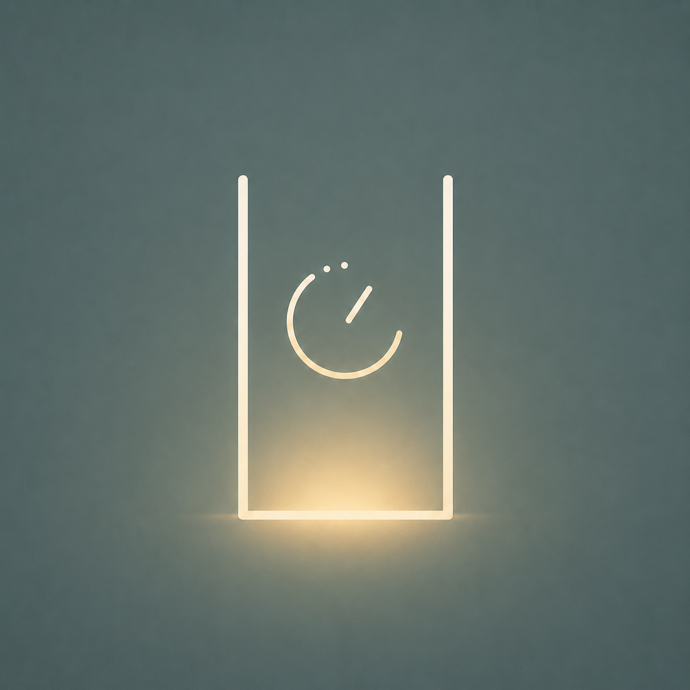
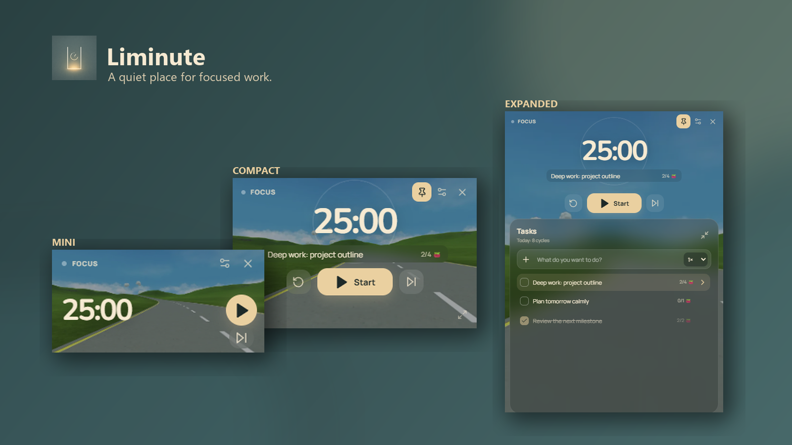
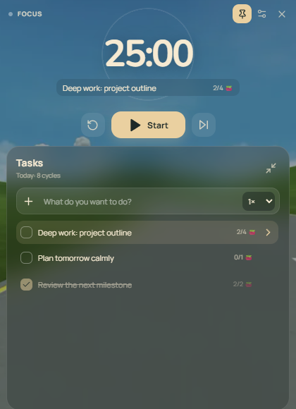
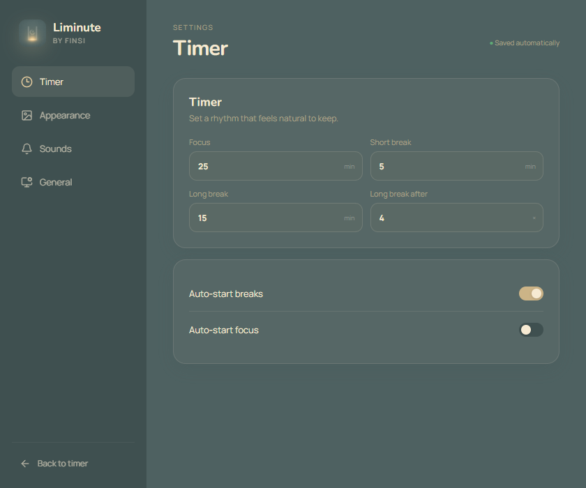
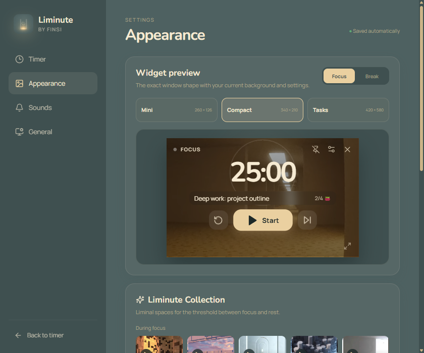
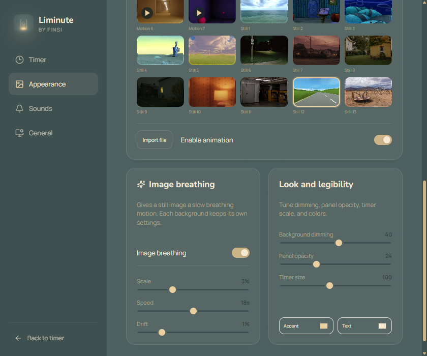
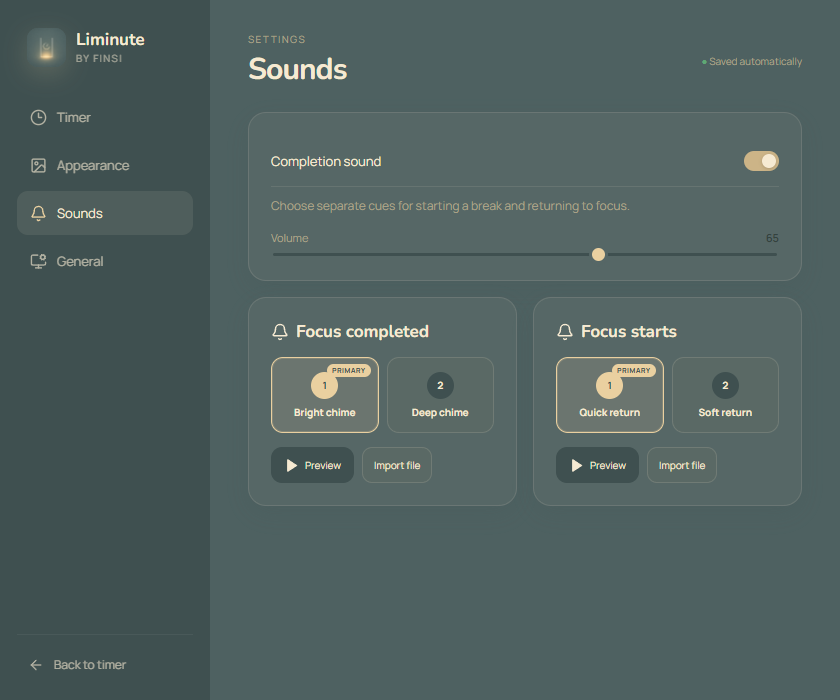
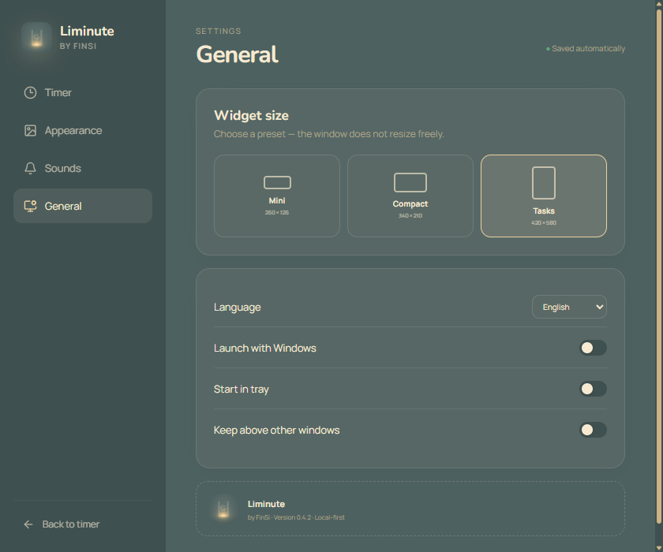

<div align="center">
  
  <h1>Liminute</h1>
  <p><strong>A liminal-space Pomodoro timer for Windows.</strong></p>
  <p>Turn the minutes between starting and stopping into a place you want to return to.</p>

  <a href="https://github.com/Fin-Si/liminute/releases/latest"></a>
  <a href="https://github.com/Fin-Si/liminute/releases/latest"></a>
  <a href="LICENSE"></a>
  <a href="#private-by-default"></a>

  <br><br>
  <a href="https://github.com/Fin-Si/liminute/releases/latest"></a>
</div>



Liminute pairs a native Pomodoro timer with empty corridors, quiet rooms, distant lights, and other liminal spaces. The background is not decoration added after the timer; it is the atmosphere that separates focused work from a break.

It can sit in a corner as a minimal clock, open into a comfortable control panel, or expand into a task list when you need more structure. Your timer, tasks, history, settings, and imported media stay on your computer.

## Why Liminute

- **A visual threshold.** Each phase has its own liminal atmosphere from the first launch.
- **As small as you need it.** Switch between Mini, Compact, and Expanded without disturbing a running or paused session.
- **A background that feels like yours.** Explore the Liminute Collection or import your own photo, GIF, APNG, or video.
- **Built for Windows, not a browser tab.** Pin it above other windows, start it with Windows, close it to the tray, and trust the native timer through sleep and restarts.

## One timer, three levels of attention

Mini keeps only the essentials in sight. Compact adds the active task and session controls. Expanded gives you a lightweight task list with estimates and completed focus sessions, without turning focus into project management.



The top bar holds Pin, Settings, and Close. Closing the widget sends it to the system tray; **Quit** in the tray menu exits it completely. The timer itself is deadline-based, so changing the window mode or pinning it does not reset a paused session.

## Set a rhythm you can actually keep

Choose the length of focus, short break, and long break phases. Liminute can start breaks automatically, return to focus automatically, or wait until you are ready.



## The Liminute Collection

The built-in collection is the visual heart of Liminute: looping hallways, unfamiliar rooms, quiet landscapes, and places that feel suspended between destinations.

Appearance uses the same Mini, Compact, and Expanded component as the real widget. Change the preview size or phase without resizing the live timer, then choose a background and see the result immediately.



## Give still images a little life

Static backgrounds can breathe slowly instead of sitting completely still. Scale controls the depth of the movement, Speed sets the length of the cycle, and Drift adds a small directional shift. Every image remembers its own profile, and reduced-motion preferences disable the effect automatically.



Liminute includes its own media adapter. Photos are normalized to compact WebP files; GIF, APNG, and video are converted to silent VP9 WebM at up to 30 FPS. The original file is never changed, and every background fills Mini, Compact, and Expanded while preserving its proportions.

## Sounds that mark the moment, not interrupt it

Focus completion and focus start have separate sound choices. Preview a cue before selecting it, adjust the master volume, or import a custom sound. The highlighted primary sounds are the defaults for a fresh installation.



## Fits into Windows quietly

Choose a fixed window preset, switch between English and Russian, launch Liminute with Windows, start it in the tray, or keep it above other windows. A clean installation follows the Windows UI language: Russian for `ru-*`, English everywhere else.



## Private by default

Liminute has no account and does not upload your activity. Tasks and focus history are stored locally in SQLite; settings and normalized backgrounds remain in the application's data folder.

## Install

1. Open the [latest release](https://github.com/Fin-Si/liminute/releases/latest).
2. Download `Liminute_0.4.2_x64-setup.exe`.
3. Run the installer and open **Liminute** from the desktop or Start menu.

The current build is unsigned, so Windows SmartScreen may ask for confirmation. This is expected for a small open-source project without a commercial code-signing certificate.

## Build from source

You will need Windows 10 or 11, Node.js 20+, a current stable Rust toolchain, WebView2, and Git LFS for the bundled FFmpeg binary.

```powershell
git clone https://github.com/Fin-Si/liminute.git
cd liminute
git lfs pull
npm install
npm run tauri build
```

The installer is written to `src-tauri/target/release/bundle/nsis/`.

For interface development, run `npm run dev`. For the native application, run `npm run tauri dev`.

## How it is built

- `src/` contains the React interface and the browser-preview backend.
- `src-tauri/` owns the native timer, persistence, tray, notifications, window management, SQLite history, and media conversion.
- `public/backgrounds/` contains the built-in background collection.

React renders state but does not advance the native timer. Rust keeps the absolute deadline as the source of truth and restores it after sleep or restart.

## Contributing and verification

Issues and focused pull requests are welcome. Before opening a pull request, run:

```powershell
npm run build
npm test
cargo test --manifest-path src-tauri/Cargo.toml
cargo check --manifest-path src-tauri/Cargo.toml
npm run tauri build
```

Release checks also cover all three window modes, English and Russian, Pin, close-to-tray, single-instance behavior, background imports, and paused-timer restoration.

## License and third-party materials

Liminute source code is available under the [MIT License](LICENSE). Bundled media and third-party components remain subject to their own terms; details are recorded in [THIRD_PARTY_ASSETS.md](THIRD_PARTY_ASSETS.md) and the [FFmpeg notice](src-tauri/resources/FFMPEG-NOTICE.txt).

<div align="center">
  <sub>Made by FinSi for the space between focus and rest.</sub>
</div>
